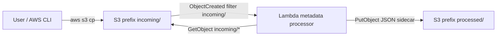

# cdk-s3-lambda-processor

Self-contained AWS CDK v2 TypeScript demo. An **S3 object-created** event on prefix `incoming/` invokes a **Lambda** that reads the uploaded object, extracts **image metadata only**, and writes a JSON sidecar to `processed/<same-relative-key>.json`.

Example:

- `incoming/sunset.png`
- `processed/sunset.png.json`

The JSON sidecar is the artifact. There is no image transform, resize, thumbnail, or native image-processing layer.

## What this is not

- Not an API. There is no API Gateway, Function URL, or public HTTP endpoint.
- Not a production image pipeline. Single stack, single environment, demo only.
- Not a website. No CloudFront, no S3 static website hosting, and the bucket blocks all public access.
- Not a shared-account pattern. The stack creates its own bucket, Lambda, log group, and IAM role. Do not import or attach existing buckets, roles, VPCs, or other stacks.

## Architecture



Lambda: Node.js 24, 256 MB, 30 s timeout, arm64. Objects larger than 5 MB get an error sidecar and are not downloaded.

Loop prevention:

1. The S3 notification filter is `incoming/` only.
2. The handler ignores keys under `processed/` and never writes under `incoming/`.
3. Oversize, non-image, and parse failures still write a processed JSON and succeed the invocation so S3 retries cannot storm.

## Cost warning

This demo runs in **your** AWS account. You pay for S3 requests and storage, Lambda invocations, and CloudWatch Logs for as long as the stack exists.

- Objects under `incoming/` and `processed/` expire after **7 days**.
- Logs retain for **7 days**.
- The bucket uses `RemovalPolicy.DESTROY` and auto-delete objects, so `npm run destroy` can empty it and remove the stack.
- `npm run destroy` also deletes leftover CloudWatch log groups from CDK custom-resource Lambdas and, if nothing else is using the region, the CDK bootstrap stack and its retained staging bucket.

Do not leave the stack running unused. Deploy, try the sample, then destroy.

## Region

The app **does not** use the AWS CLI default region and **does not** fall back to `us-east-1`. Set the region in one of these places (first match wins):

1. `CDK_DEPLOY_REGION` in the environment (explicit override)
2. `context.region` in `cdk.json` (repo default: `us-west-2`)

```bash
export CDK_DEPLOY_REGION=eu-west-1   # optional; otherwise cdk.json is used
```

Bootstrap, deploy, sample commands, and destroy must all use that same region. AWS CLI commands below use `"$REGION"` as a reminder to pass it on the CLI as well:

```bash
REGION="${CDK_DEPLOY_REGION:-us-west-2}"
```

The demo bucket name includes the region: `cdk-s3-lambda-processor-<account-id>-<region>`.

## Prerequisites

- Node.js 20+
- AWS CDK v2 (this repo installs the CLI locally; `npm run cdk` / `npx cdk`)
- AWS credentials with permission to deploy CloudFormation, S3, Lambda, IAM, Logs, and (for bootstrap teardown) ECR
- An explicit region, as above

## Bootstrap

Once per account/region (replace `ACCOUNT_ID` and use the same region you configured):

```bash
npx cdk bootstrap aws://ACCOUNT_ID/$REGION
```

`npm run deploy`, `npm run destroy`, and `npm run cdk` wrap the CLI with AWS SDK retries and skip EC2 instance-metadata lookups. That reduces false failures when the local network drops briefly: the CDK progress bar uses a 10s socket timeout and may print `@smithy/node-http-handler` `TimeoutError` while CloudFormation is still working.

If that happens, **do not destroy and recreate**. Check CloudFormation:

```bash
aws cloudformation describe-stacks --stack-name CdkS3LambdaProcessor --region "$REGION" --query "Stacks[0].StackStatus"
aws cloudformation wait stack-create-complete --stack-name CdkS3LambdaProcessor --region "$REGION"
```

Re-run the CDK command only when status is `CREATE_COMPLETE` / `UPDATE_COMPLETE` (safe continue) or a true `ROLLBACK_*` / `CREATE_FAILED`.

## Deploy

```bash
npm install
npm test
npm run synth
npm run deploy
```

The stack name is `CdkS3LambdaProcessor`. The bucket is **created by this stack**. The project never looks up or imports an existing bucket.

Capture outputs:

```bash
BUCKET=$(aws cloudformation describe-stacks \
  --stack-name CdkS3LambdaProcessor \
  --region "$REGION" \
  --query "Stacks[0].Outputs[?OutputKey=='BucketName'].OutputValue" \
  --output text)
```

## Upload the sample and read the JSON

```bash
aws s3 cp samples/sunset.png s3://$BUCKET/incoming/sunset.png --region "$REGION"

# Give the notification / Lambda a few seconds, then:
aws s3 cp s3://$BUCKET/processed/sunset.png.json - --region "$REGION"
```

The sidecar includes at least `bucket`, `key`, `size`, `contentType`, `etag`, `sha256` of the object bytes, `processedAt` (ISO-8601), image `width` / `height` / `format` when parseable, selected EXIF when present, and a `notes` array if the file is not a supported image, too large (5 MB cap), or metadata is incomplete.

## Destroy

```bash
npm run destroy
```

That script targets `CdkS3LambdaProcessor` in `CDK_DEPLOY_REGION` (or `cdk.json` `context.region`). It is safe to re-run after a previous destroy. It:

1. Passes `--force`, empties the demo bucket (including leftover `incoming/` and `processed/` objects), and deletes the stack. If the CDK CLI watcher times out, it keeps polling CloudFormation until the stack is gone.
2. Deletes leftover CloudWatch log groups named `/aws/lambda/CdkS3LambdaProcessor*`. CDK custom-resource Lambdas (S3 notifications and auto-delete objects) create those groups outside CloudFormation, so stack deletion alone leaves them behind.
3. Removes unused CDK bootstrap in that region: the `CDKToolkit` stack, the retained staging bucket `cdk-hnb659fds-assets-<account>-<region>`, and the bootstrap ECR repository if it is still present.

Keep bootstrap if you still use CDK in that region:

```bash
npm run destroy -- --keep-bootstrap
# or: KEEP_BOOTSTRAP=1 npm run destroy
```

Bootstrap teardown is skipped automatically when other CloudFormation stacks still exist in the region. Re-bootstrap before the next deploy if you removed it:

```bash
npx cdk bootstrap aws://ACCOUNT_ID/$REGION
```

## How to change the handler

1. Edit `src/handler.ts` (event loop, size cap, sidecar write) and/or `src/metadata.ts` (dimensions + EXIF).
2. Keep writing sidecars under `processed/` only. Do not add writes under `incoming/`.
3. Run `npm test`, then `npm run deploy`.

`NodejsFunction` bundles TypeScript with esbuild targeting Node.js 24. `bundling.externalModules` is `@aws-sdk/*` so the zip uses the runtime-provided SDK rather than shipping a copy. Remaining handler dependency: `exifreader` (pure JS). Dimensions come from a small header parser in `src/metadata.ts`. No Sharp, ImageMagick, or native layers. The function does not call `HeadObject`; size comes from the S3 event, matching IAM `s3:GetObject` on `incoming/*` and `s3:PutObject` on `processed/*`.

## Layout

| Path | Role |
| --- | --- |
| `bin/app.ts` | CDK app; region from env or `cdk.json` |
| `lib/cdk-s3-lambda-processor-stack.ts` | Single stack: bucket + Lambda + logs + IAM |
| `lib/region.ts` | Explicit region resolution |
| `src/handler.ts` | Lambda entry |
| `src/metadata.ts` | Lightweight image metadata (no transform) |
| `scripts/destroy.sh` | Delete the stack, leftover log groups, and unused CDK bootstrap |
| `test/` | Handler unit tests (mock S3) and CDK assertions |
| `samples/sunset.png` | Small real PNG fixture |

## CI

GitHub Actions runs `npm ci`, `npm test`, and `npx cdk synth` on push and pull request. **CI does not deploy to AWS.** This repository does not contain account IDs or access keys.

## Self-contained

Everything this project creates lives in one stack, `CdkS3LambdaProcessor`, plus the usual per-region CDK bootstrap (`CDKToolkit` and its staging bucket) if that region was not already bootstrapped. It is meant to be deployed into an empty area of an account and removed with `npm run destroy`. Do not wire it to other account resources.
